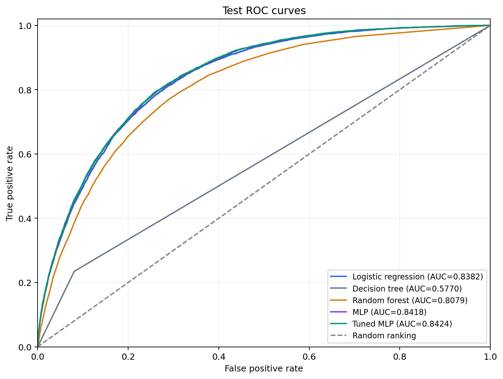
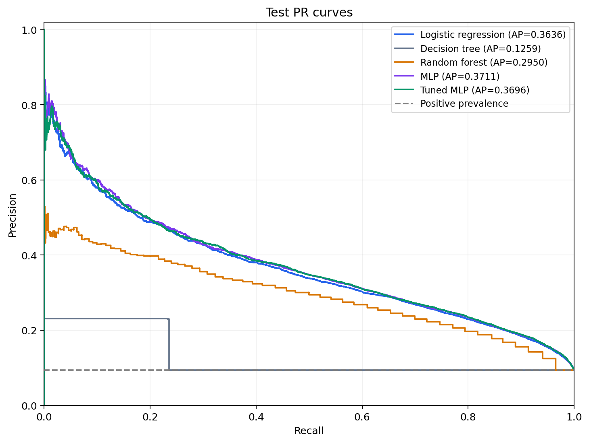
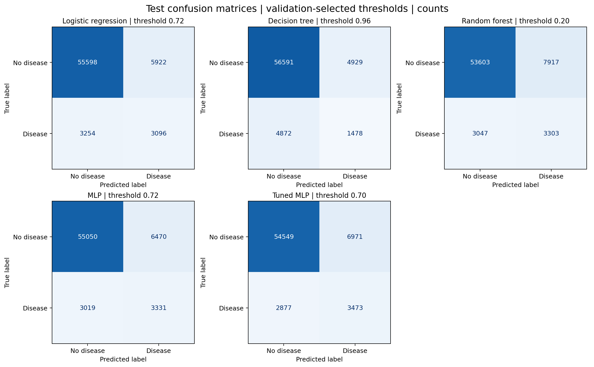
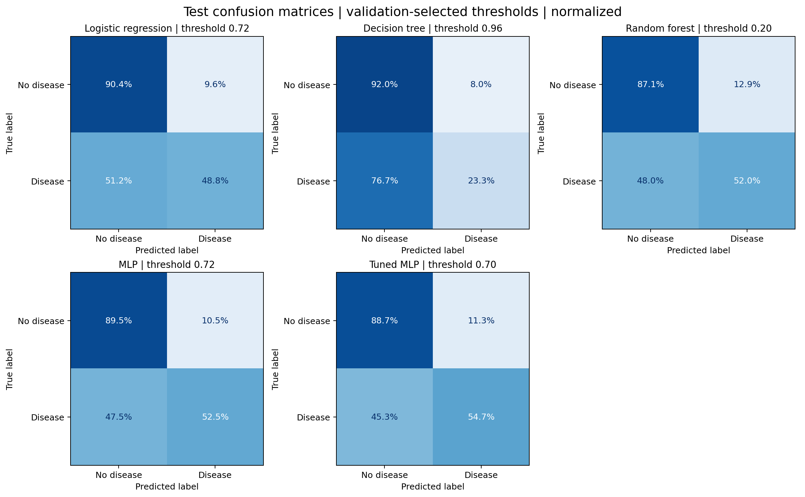
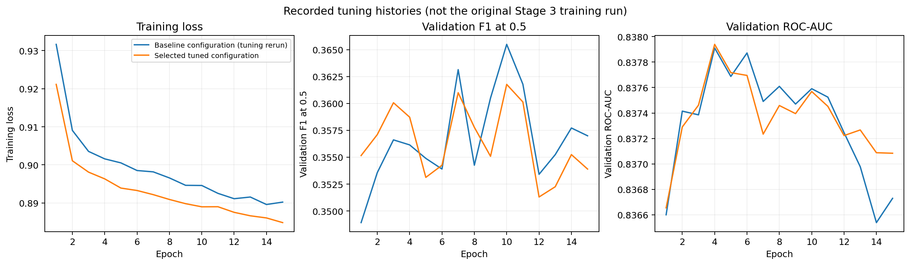

# 5. Results

## 5.1 Evaluation protocol

The task is binary classification of self-reported heart-disease history, not prospective
prediction of a future diagnosis. The supplied processed splits contain 316,724
training, 67,870 validation and 67,870 test rows.
The positive prevalence is 9.36% on validation and
9.36% on test. All five models are evaluated on the same checked row IDs
and targets. Preprocessing is fitted on train only. The selected model is **tuned MLP**,
carried forward from Stage 4; test results do not change this selection.

Thresholds are selected by maximum validation F1 over 0.01–0.99 in steps of 0.01;
ties choose the smallest threshold. Predictions use `probability >= threshold`.
The protocol is written to `results/evaluation/frozen_protocol.json` before test is loaded.
A second comparison fixes all thresholds at 0.5. Threshold selection and reporting on
validation make validation scores optimistic development estimates, not final test scores.
ROC-AUC and average precision (AP) use scores, not binary predictions. AP is not the
trapezoidal integral of the PR curve. Precision/recall/F1 use the positive class (1).
Undefined precision/F1 are set to zero; undefined subgroup AUC is reported as NA.

| model | threshold |
| --- | --- |
| logistic_regression | 0.7200 |
| decision_tree | 0.9600 |
| random_forest | 0.2000 |
| mlp | 0.7200 |
| mlp_tuned | 0.7000 |

Legacy baseline pipelines were not saved, so their fixed configurations were refitted on
train in the recorded environment. MLP weights were loaded without retraining; their
train-reconstructed preprocessing was checked by replaying validation predictions with
absolute/relative tolerance 2e-5. All Stage 5 validation and test tables use the resulting
same model instances; the legacy Stage 2–4 CSVs are preserved. The audit below quantifies
reconstruction differences rather than assuming exact reproduction across environments.
The logistic-regression legacy L2 defaults are mapped to equivalent scikit-learn 1.8 defaults.

| model | matches_legacy_at_2e-5 | validation_max_probability_difference | validation_mean_probability_difference | legacy_label_disagreements_at_0.5 |
| --- | --- | --- | --- | --- |
| logistic_regression | True | 0.00000002 | 0.00000000 | 0 |
| decision_tree | True | 0.00000000 | 0.00000000 | 0 |
| random_forest | True | 0.00000000 | 0.00000000 | 106 |
| mlp | True | 0.00000018 | 0.00000001 | 0 |
| mlp_tuned | True | 0.00000015 | 0.00000001 | 10599 |

The last column compares legacy `y_pred` with `y_proba >= 0.5`; for tuned MLP it reflects
the intentionally different saved threshold. For random forest, equality at 0.5 and CSV
rounding must be distinguished from changes caused by model reconstruction. Stage 5 always
uses the documented common threshold rule and its own full-precision prediction export.

## 5.2 Model comparison

**Final test results with validation-selected thresholds**:

| model | threshold | accuracy | precision | recall | f1 | roc_auc | average_precision |
| --- | --- | --- | --- | --- | --- | --- | --- |
| logistic_regression | 0.7200 | 0.8648 | 0.3433 | 0.4876 | 0.4029 | 0.8382 | 0.3636 |
| decision_tree | 0.9600 | 0.8556 | 0.2307 | 0.2328 | 0.2317 | 0.5770 | 0.1259 |
| random_forest | 0.2000 | 0.8385 | 0.2944 | 0.5202 | 0.3760 | 0.8079 | 0.2950 |
| mlp | 0.7200 | 0.8602 | 0.3399 | 0.5246 | 0.4125 | 0.8418 | 0.3711 |
| mlp_tuned | 0.7000 | 0.8549 | 0.3325 | 0.5469 | 0.4136 | 0.8424 | 0.3696 |

**Final test results at the common threshold 0.5**:

| model | threshold | accuracy | precision | recall | f1 | roc_auc | average_precision |
| --- | --- | --- | --- | --- | --- | --- | --- |
| logistic_regression | 0.5000 | 0.7468 | 0.2385 | 0.7783 | 0.3652 | 0.8382 | 0.3636 |
| decision_tree | 0.5000 | 0.8543 | 0.2292 | 0.2357 | 0.2324 | 0.5770 | 0.1259 |
| random_forest | 0.5000 | 0.9039 | 0.4359 | 0.0915 | 0.1512 | 0.8079 | 0.2950 |
| mlp | 0.5000 | 0.7522 | 0.2429 | 0.7791 | 0.3704 | 0.8418 | 0.3711 |
| mlp_tuned | 0.5000 | 0.7465 | 0.2403 | 0.7909 | 0.3686 | 0.8424 | 0.3696 |

Always-negative predictions would achieve accuracy 0.9064 and positive-class
F1/recall zero on this test set. This explains why accuracy alone is an inadequate comparison.

**Validation results with validation-selected thresholds** (development estimates):

| model | threshold | accuracy | precision | recall | f1 | roc_auc | average_precision |
| --- | --- | --- | --- | --- | --- | --- | --- |
| logistic_regression | 0.7200 | 0.8642 | 0.3418 | 0.4875 | 0.4018 | 0.8346 | 0.3542 |
| decision_tree | 0.9600 | 0.8550 | 0.2329 | 0.2393 | 0.2361 | 0.5789 | 0.1271 |
| random_forest | 0.2000 | 0.8348 | 0.2868 | 0.5147 | 0.3684 | 0.8012 | 0.2828 |
| mlp | 0.7200 | 0.8588 | 0.3349 | 0.5157 | 0.4061 | 0.8376 | 0.3568 |
| mlp_tuned | 0.7000 | 0.8540 | 0.3291 | 0.5401 | 0.4090 | 0.8376 | 0.3561 |

Tuned MLP achieves test F1 **0.4136**, ROC-AUC **0.8424** and
AP **0.3696**. Its F1 difference from original MLP is
+0.0011; from logistic regression it is
+0.0107. Comparing the tuned MLP at its selected
threshold with baselines only at 0.5 would confound threshold changes with model changes.
The validation-to-test F1 change for tuned MLP is +0.0046.
See `validation_test_comparison.csv` for all model/metric differences.

## 5.3 Uncertainty and paired comparisons

The following 95% percentile intervals use 1000 IID row-bootstrap resamples (seed 42)
on test. Each resample uses the same row indices for every model. Models and thresholds remain
fixed; these intervals describe test-sample uncertainty conditional on the fitted models.
They do not include training-seed or hyperparameter-selection variability, nor BRFSS survey
clustering/weights. Pairwise intervals are exploratory and are not multiplicity-adjusted.

| model | metric | estimate | lower_95 | upper_95 |
| --- | --- | --- | --- | --- |
| logistic_regression | f1 | 0.4029 | 0.3929 | 0.4128 |
| logistic_regression | roc_auc | 0.8382 | 0.8336 | 0.8428 |
| logistic_regression | average_precision | 0.3636 | 0.3519 | 0.3767 |
| decision_tree | f1 | 0.2317 | 0.2214 | 0.2416 |
| decision_tree | roc_auc | 0.5770 | 0.5715 | 0.5825 |
| decision_tree | average_precision | 0.1259 | 0.1211 | 0.1301 |
| random_forest | f1 | 0.3760 | 0.3665 | 0.3846 |
| random_forest | roc_auc | 0.8079 | 0.8027 | 0.8130 |
| random_forest | average_precision | 0.2950 | 0.2845 | 0.3057 |
| mlp | f1 | 0.4125 | 0.4027 | 0.4222 |
| mlp | roc_auc | 0.8418 | 0.8372 | 0.8462 |
| mlp | average_precision | 0.3711 | 0.3586 | 0.3839 |
| mlp_tuned | f1 | 0.4136 | 0.4037 | 0.4237 |
| mlp_tuned | roc_auc | 0.8424 | 0.8379 | 0.8468 |
| mlp_tuned | average_precision | 0.3696 | 0.3574 | 0.3818 |

| comparison | metric | estimate | lower_95 | upper_95 |
| --- | --- | --- | --- | --- |
| mlp_tuned - logistic_regression | f1 | 0.010685 | 0.005273 | 0.015859 |
| mlp_tuned - logistic_regression | roc_auc | 0.004151 | 0.002956 | 0.005309 |
| mlp_tuned - logistic_regression | average_precision | 0.005989 | 0.002606 | 0.009482 |
| mlp_tuned - decision_tree | f1 | 0.181884 | 0.170304 | 0.192916 |
| mlp_tuned - decision_tree | roc_auc | 0.265362 | 0.259174 | 0.271413 |
| mlp_tuned - decision_tree | average_precision | 0.243753 | 0.233111 | 0.255111 |
| mlp_tuned - random_forest | f1 | 0.037618 | 0.031218 | 0.044516 |
| mlp_tuned - random_forest | roc_auc | 0.034433 | 0.031045 | 0.037785 |
| mlp_tuned - random_forest | average_precision | 0.074609 | 0.066690 | 0.082095 |
| mlp_tuned - mlp | f1 | 0.001118 | -0.002181 | 0.004343 |
| mlp_tuned - mlp | roc_auc | 0.000571 | 0.000030 | 0.001064 |
| mlp_tuned - mlp | average_precision | -0.001509 | -0.003439 | 0.000588 |

For tuned versus original MLP, the paired F1 difference interval
[-0.0022, 0.0043] includes zero, so these data do not establish a clear difference.
Stage 4 seed experiments additionally show training variability; a small observed advantage
must not be described as a general architectural improvement from a single split/seed.

## 5.4 ROC, PR and confusion matrices





The ROC diagonal represents random ranking; the PR horizontal reference is the test positive
prevalence. The PR plot makes the precision–recall tradeoff visible for the minority class.





Rows are true labels and columns are predicted labels. Normalization is within each true class,
so the positive-class off-diagonal entry is the false-negative rate. Fixed-0.5 matrices and
validation plots are also saved under `results/evaluation/figures/`.

## 5.5 Training behaviour



These curves compare `exp01_baseline` (a tuning rerun of the base configuration) with
`exp_hidden_256` (the selected configuration). They are not the original Stage 3 training
history. The original logs contain training loss and validation F1/ROC-AUC, but no validation
loss. Consequently no historical validation-loss curve is fabricated and loss-based
overfitting claims cannot be established here. The training code now logs validation loss
and exports preprocessing/history for future runs. Validation F1 in the epoch logs uses 0.5,
which differs from the final selected operating threshold. Training loss is the recorded
mean of batch losses in training mode, including dropout; it is not evaluation-mode train loss.

| experiment | best_epoch_by_val_f1_at_0.5 | recorded_epochs | best_val_f1_at_0.5 |
| --- | --- | --- | --- |
| exp01_baseline | 10 | 15 | 0.3655 |
| exp_hidden_256 | 10 | 15 | 0.3618 |

Training loss decreases while validation F1 fluctuates and validation ROC-AUC remains close
to 0.837. Later epochs do not consistently improve validation performance, supporting the
use of the saved best epoch rather than the last epoch. The ROC-AUC panel has a narrow
vertical range; visually noticeable fluctuations correspond to small absolute changes.

## 5.6 Error analysis

| model | tn | fp | fn | tp | precision | recall | false_positive_rate | false_negative_rate |
| --- | --- | --- | --- | --- | --- | --- | --- | --- |
| logistic_regression | 55598 | 5922 | 3254 | 3096 | 0.3433 | 0.4876 | 0.0963 | 0.5124 |
| decision_tree | 56591 | 4929 | 4872 | 1478 | 0.2307 | 0.2328 | 0.0801 | 0.7672 |
| random_forest | 53603 | 7917 | 3047 | 3303 | 0.2944 | 0.5202 | 0.1287 | 0.4798 |
| mlp | 55050 | 6470 | 3019 | 3331 | 0.3399 | 0.5246 | 0.1052 | 0.4754 |
| mlp_tuned | 54549 | 6971 | 2877 | 3473 | 0.3325 | 0.5469 | 0.1133 | 0.4531 |

At threshold 0.70, tuned MLP misses **2,877** of
**6,350** positive test cases (45.3%) and produces
**6,971** false positives. Precision is 33.3%, so a positive model
prediction should not be interpreted as a confirmed diagnosis. The max-F1 operating point
optimizes an empirical classification metric, not an established clinical utility function.

For tuned MLP, descriptive subgroup results are:

| feature | group | n_samples | tp | fn | fp | tn | recall | false_positive_rate | precision |
| --- | --- | --- | --- | --- | --- | --- | --- | --- | --- |
| sex | Female | 35661 | 1135 | 1513 | 2391 | 30622 | 0.4286 | 0.0724 | 0.3219 |
| sex | Male | 32209 | 2338 | 1364 | 4580 | 23927 | 0.6316 | 0.1607 | 0.3380 |
| age | 45-64 | 21591 | 616 | 984 | 1261 | 18730 | 0.3850 | 0.0631 | 0.3282 |
| age | 65+ | 25463 | 2815 | 1634 | 5610 | 15404 | 0.6327 | 0.2670 | 0.3341 |
| age | under 45 | 20816 | 42 | 259 | 100 | 20415 | 0.1395 | 0.0049 | 0.2958 |

Age groups are under 45, 45–64 and 65+; the dataset codes sex as 0=male, 1=female.
Rates must be read with their denominators, especially positive counts for recall.
These subgroup comparisons are exploratory; they do not establish causal explanations or
formal fairness conclusions. `test_subgroup_metrics.csv` includes all five models.
For tuned MLP, recall is 14.0% below age 45 versus
63.3% at age 65+, while the corresponding false-positive rates
are 0.5% and
26.7%. Thus the overall recall hides substantially
different error patterns by age. Recall is 42.9% for female
respondents versus 63.2% for male respondents at the same threshold.
These differences warrant further validation; age distributions, prevalence and feature
composition may differ across groups and have not been controlled in this descriptive analysis.
`test_error_examples.csv` contains the ten lowest-score false negatives and ten highest-score
false positives per model, with checked corresponding input features. These are deliberately
extreme examples, not a representative sample of all errors.

## 5.7 Limitations and reproducibility

The data describe self-reported history and may contain label noise. Evaluation uses one
random within-dataset split, without temporal/external validation or survey weighting.
Repeated validation use introduces selection optimism. Weighted training scores are not
shown to be calibrated disease probabilities. The processed data retain no respondent IDs,
so evaluation verifies row alignment but cannot independently audit respondent-level overlap
from these files alone. This work evaluates a dataset classifier and does not establish
clinical deployment suitability.

Environment: Python 3.11.2, NumPy 2.3.1, pandas 2.3.0,
scikit-learn 1.8.0, PyTorch 2.6.0; CPU inference.
Source and artifact SHA-256 hashes are recorded in `results/evaluation/manifest.json`.

From the repository root:

```bash
python3 -m pip install -r requirements-evaluation.txt
# Once, if frozen evaluation artifacts do not exist:
python3 src/predict_test.py
# Rebuild tables, plots and this report from frozen predictions:
python3 src/evaluation.py --bootstrap 1000 --seed 42
python3 -m unittest discover -s tests -v
```

`predict_test.py` refuses to overwrite a completed frozen evaluation. Analysis can be rerun
without training or new test inference. Legacy predictions and Stage 2–4 reports are inputs,
not overwritten outputs. Full fitted baseline pipelines are local reproducibility artifacts
excluded from Git for size; they are reconstructed by `predict_test.py` when needed.


### Reproduce inference in a separate directory

To reconstruct the fixed baselines and replay the original MLP weights without replacing
this frozen experiment, choose a new directory for both commands:

```bash
python3 src/predict_test.py --output-dir results/evaluation_runs/recheck
python3 src/evaluation.py --output-dir results/evaluation_runs/recheck --bootstrap 1000 --seed 42
```

The separate report is `results/evaluation_runs/recheck/05_results.md`; its figures and
predictions are stored alongside it. A completed inference run cannot be overwritten.
Choose another unused directory for a further replay. This is a reproducibility check of
fixed models and thresholds selected on validation, not additional tuning on test.
